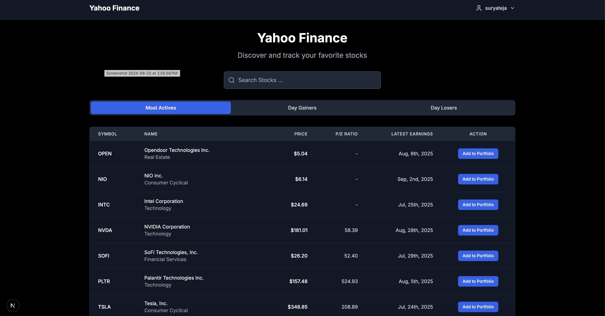
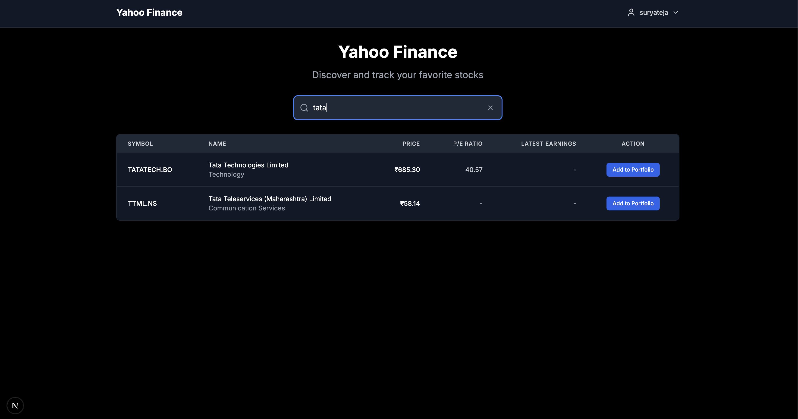
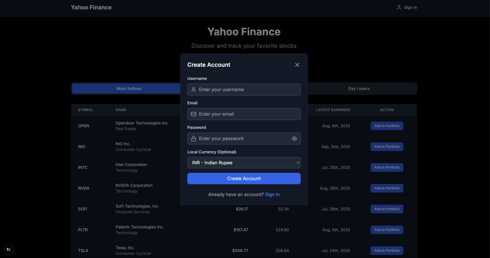
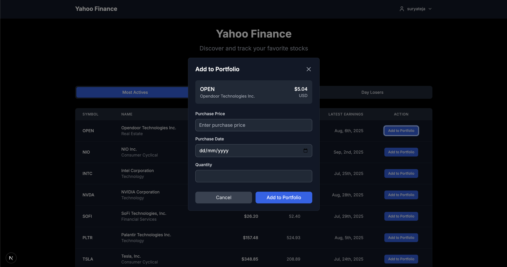
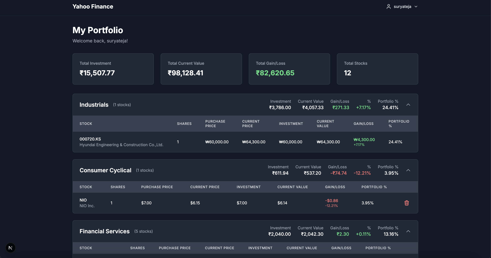

# Getting Started

## Server Setup

- **Framework & Stack:** The server is built using Node.js, Express.js, TypeScript, and MySQL.
- **Prerequisites:** Ensure Node.js and MySQL are installed on your system. Set the Node.js version to 22 (or above) to avoid runtime issues.
- **Navigation:** Go to the `server` directory.
- **Environment Setup:** Create a `.env` file by referencing the `.env.example` file and fill in the required details. Provide DB_HOST, DB_PORT, DB_USERNAME, DB_PASSWORD and rest have fallback values defined in application.
- **Dependencies:** Run `npm install` from the server root directory to install all dependencies.
- **Start Server:** Run `npm run dev`. Verify that the database connects successfully and the server is running on the desired port.

## Client Setup

- **Framework & Stack:** The client is built with Next.js 15 using the app router, integrated TypeScript, and TailwindCSS.
- **Navigation:** Go to the `client` directory.
- **Environment Setup:** Create a `.env.local` file by referencing the `.env.example` file.
- **Dependencies:** Run `npm install` from the client root directory to install all dependencies.
- **Start Client:** Run `npm run dev`. Ensure the Next.js development server is up and running on the specified port.

---

# Functionality Overview

- **Live Stock Dashboard:** Users can view live stock data, including most active stocks, top day gainers, and day losers.
- **Global Stock Search:** Search for any stock globally and view its details in real time.
- **User Portfolio:** Users can log in or register to add stocks to their portfolio. The portfolio displays purchased stocks grouped by sector.
- **Investment Tracking:** Real-time dashboard showing aggregated investments, current value, and total gain/loss, helping users make informed buy/sell decisions.
- **Comprehensive Tracking:** Track individual and aggregated stock values, returns, and portfolio performance all in one place.

---

# Technical Implementation Details

1. **Data Fetching:**  
   Real-time stock data is fetched from Yahoo Finance using an unofficial SDK. Additional services scrape data from Google Finance, as no official APIs are available.
2. **Universal Stock Search:**  
   Users can search for any stock globally and add it to their portfolio.
3. **Rate Limiting:**  
   Backend API endpoints implement rate limiting to prevent DDoS attacks.
4. **Input Validation:**  
   Inputs are validated using Joi schema to prevent XSS attacks.
5. **Database Schema:**  
   User and stock data are persisted using Sequelize ORM with MySQL, designed for scalability and future enhancements.
6. **Caching:**  
   Response times are improved via in-memory node-cache for both public and authenticated endpoints.
7. **Authentication:**  
   Protected endpoints use JWT authentication with middleware. A global error handler catches unhandled controller errors, eliminating the need for repetitive try-catch blocks (unless custom error messages are required).
8. **Modular & Typed Code:**  
   The codebase uses modular, reusable, and typed utility functions/services for maintainability and scalability.
9. **Error Handling:**  
   API errors are handled gracefully, with user-friendly messages shown via React Toast. UI states (loading, error) provide clear feedback.
10. **Token Management:**  
    Refresh and access token rotation is implemented for security, with logic managed seamlessly across frontend and backend.
11. **Real-time Updates:**  
    The frontend uses `setInterval` and event emitters to refresh data without page reloads. Changes are reflected optimistically, without visible loaders.
12. **Currency Conversion:**  
    Third-party SDKs handle conversion of all stock values to a unified local currency, enabling accurate tracking of investments, returns, and portfolio allocation.
13. **Debounced Search:**  
    Stock search APIs use debouncing to reduce unnecessary calls on every keystroke.

---

# Challenges & Future Improvements

- **Learning Curve:**  
  As a newcomer to Next.js, I am still exploring its app router and best practices. This project is a foundational step toward building more polished and user-friendly interfaces, but there’s much more to leverage in the framework.
- **Data Source Consistency:**  
  The main challenge was conflicting stock identifiers between Yahoo Finance and Google Finance. Due to inconsistent symbol codes, I focused on Yahoo Finance for real-time data, but created a service to scrape Google Finance for future flexibility.
  https://quant.stackexchange.com/questions/8280/difference-between-google-finance-and-yahoo-finance
- **Client-Side State Management:**  
  Currently, client-side data is not persistently stored (e.g., with Redux, Zustand, etc.) across page navigations. While this approach was chosen to keep app simple, implementing a persistent store could further optimize performance and user experience.
- **Future Enhancements:**  
  - Implement persistent global state on the client-side.
  - Explore more robust third-party APIs or aggregated data sources for stock data.
  - Further optimize caching strategies for scale.
  - Expand schema relations for new features as the application grows.
- **AI for UI Development:**
  - Due to time constraints, I utilized AI tools for CSS styling to quickly design a clean and attractive user interface. This allowed me to focus on core functionality while still delivering a visually appealing frontend.

---

**This application provides a comprehensive, real-time stock tracking experience, with robust backend security, scalable architecture, and a responsive, user-friendly frontend.**

